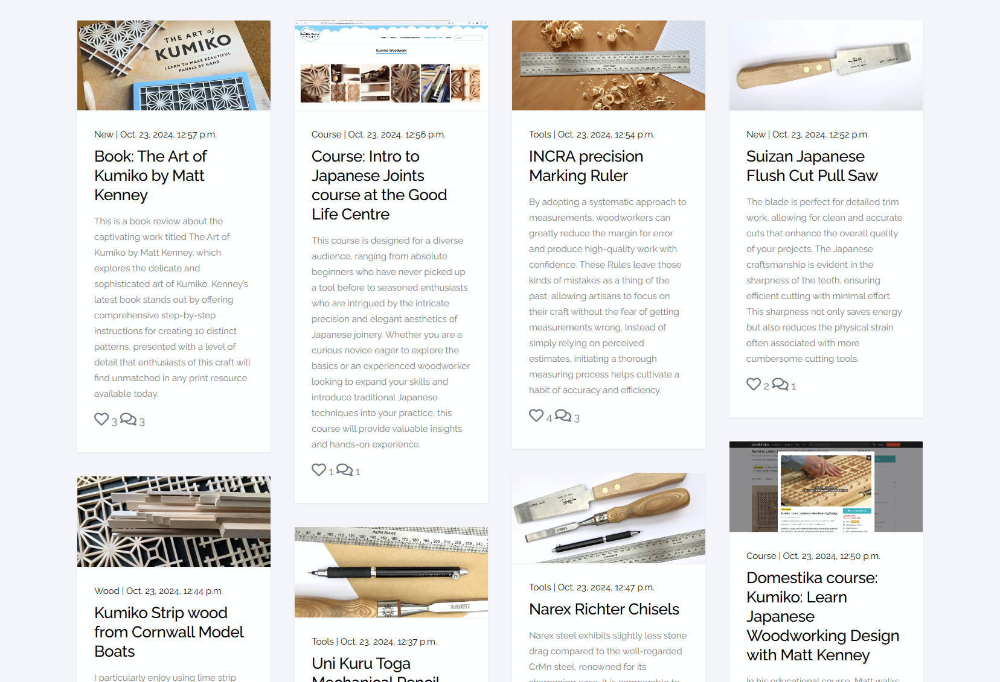
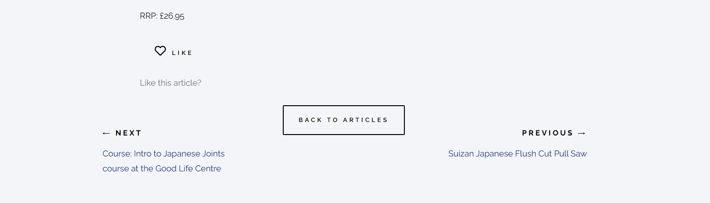

# Kumiko Community Hub

KCH is a vibrant community hub for individuals who are passionate about kumiko, providing a welcoming space for people to learn, share, and grow their skills in this intricate art form. Through workshops, tutorials, and collaborative projects, members can deepen their understanding and appreciation of kumiko while connecting with others who share their enthusiasm. Whether you're a beginner eager to explore or an experienced artisan looking to refine your techniques, KCH fosters a nurturing environment where creativity thrives and friendships flourish.

The live website can be accessed [here](https://kumiko-b16d8bc28246.herokuapp.com/) 

# Features

## Existing features
### Abstract template from StyleShout
The site layout is adapted from the free bootstrap template from [StyleShout](https://styleshout.com/abstract-modern-masonry-blog-website-template/) called Abstract. It has a very clean, minimal style and a great gallery display design.

### Hero banner
The hero photography is if Kumiko projects carried out by Anny Devoy, with the photograpgy by Megan Abel. It has a very simple message about the core principles of the community and invites people to join. The hero is a picture element, with differnt images to make efficiently responsive to screen size.

### Logo
The logo was designed by Megan Abel, a graphic designer and wife of the site owner. The logo reflects the style of kumiko panels while incorporationg the KCH intials of the Kumiko Community Hub.

### Article Gallery
The article gallery on the homepage displays cards of individual articles, with card heights varying according to excerpt length. The cards act as links to the full article. 
#### Masonry brick animated cards
The gallery from the Abstract template is based on Masonry which is a JavaScript grid layout library made by [David DeSandro](https://masonry.desandro.com/). It works by placing elements in optimal position based on available vertical space, like a mason fitting stones in a wall. This leads to a adaptive animation of the cards as screen size and card height changes. The card visual styling comes from the Abstract template.

#### Pagination
Gallery pagination is set to display of a maximum of 8 cards per page, with arrows and page numbers for navagation. The active page number is highlighted visually to assist user navagation.

### base.html
The base.html contributes all page meta, css and js links plus Navbar, footer and alert messaging areas.
#### Navbar
The Navbar has KCH branding, links to Home, About and Contact on the right, and adaptive links to login/logout/register based on login status as well as a displaying a statement indicating login status. If logged in it contains username as part of 'you are logged in as...' statement.

#### Footer
The footer styling comes from Abstract template. It has a short description of KCH, links to pages and external social links, plus an invite to get in contact with a link to the contact form. It also has copyright and required acknowledgement to StyleShout for Abstract template usage.

### Single Article
The single articles page displays a single article instance along with likes and comments associated with that article.
#### Display of single article
The page provides a stylised visual presentation of all Article model field entries, except slug, author and status. Author is not displayed as presently only the super-user can submit an article through the admin panel. Cloudinary is used to externally serve the images.

#### Likes and comments counts
Number of likes and approved comments are displayed at top of article, just above the article image.
#### Approved comments
Approved comments are displayed below the article. If the user is logged in and has a comment awaiting approval this will also appear in comments list. All comments made by the logged in user will also now display edit and delete buttons below to enable full CRUD functionality.

#### Like button
When logged in the like/unlike toggle button becomes visible. It toggles between outline (user has not liked article) and solid (user likes article). When solid it also add an increment of 1 to the likes counter.

#### Comment form
When logged in the comment form is displayed and the user can submit a comment. If the user wants to edit a comment the comment is displayed in the form to change and resubmit.

### About Us
The about us page displays an about instance.
#### Display of about
The page provides a stylised visual presentation of all about model field entries. Cloudinary is used to externally serve the images.

#### Register Banner
The about page has a banner inviting new visitor to join the community and links to the sign-up page.

### Contact
The contact page displays a contact instance.
#### Display of contact
The page provides a stylised visual presentation of all contact model field entries, except updated_on. Cloudinary is used to externally serve the images.

#### Contact form
The contact form allows a site visitor to send a message to the site admin. There is no requirement for the user to be logged in for this action.

## Future features
### User submitted projects gallery
A key future development, given kumiko is a very visual craft/artform, it to provide community members an opportunity to share images of thier own projects with a short description. This would allow members to submit an image and short description, which would get displayed in a community gallery after admin approval. The gallery would have smaller cards than article gallery and users cn click on card to open a modal (instagram-style) to read full description and leace commments and likes. The ability to like a project straiht off the card would also be important.

### Homepage that displays selction of articles and user submitted projects
Once community project submissions are enabled the homepage shows a selection of both articles and submitted projects, with new projects and articles gallerys on seperate pages with pagentation.

### Conversation Threads
The ability to respnd to a comment directly and start a discussion thread from that comment. Presently all comments are independent

### Display of like and comment counts on gallery cards
An ability to display the like and comment counts on the gallery cards would improve user experience and engagement, enticing users to indicate thier feelings and commments.

### Update Django-cloudinary to newer version 
To allow presentation of images via HTTPS, not HTTP. Use of HTTP gives a warning in the console and significantly reduces the Lighthouse score for best practises for all pages displaying a Cloudinary-stored image.

### Increase user navigation ability
Present navigation back and forth on pages is limited. An ability to paginate through articles from the single article page would make a nice improvement to UX.

# App design process

## Rationale
A full site project outline can be viewed [here](https://docs.google.com/document/d/1W2LfAeY3Gkv_EZSodBBBzSgNinVPhwcOKg3yjh0x3Fs/edit?usp=sharing)

In summary, is a social initiative to support a community space for people interested in the Japanese woodcraft of Kumiko - detailed geometric wood panels for interior decoration applications. It is for those who have a background in woodcraft including Japanese joinery and Kumiko or who want to learn. The site allows users to access and share information about Kumiko and related resources.

## Goal
 A website that:
 - is user friendly and intuitive
 - provides useful information to the community
 - encourages sharing of information through comments and messages to site admin
 - encourages engagement and support through ability to 'like' content
 - Has easy interface for site adim to upload new articles with auto-formatting of content

## Data Models
### Project structure

### Data models ERD

The data models used are summarised as follows:
Article:
- article: stores all information for presenting a single article
- article like: stores like status for single article 
- article comment: stores comments for single article

About:
- about: stores all information for presenting a single about us page

Contact:
- contact: stores all information for presenting a single contact page
- contact form: stores message from user for admin to view

## Development process
The app development, for each app included in the project, followed the steps outlined below:
1. create app in kumiko Django project
2. Do mminimum wireup of settings.py, views.py and urls.py and creating html template as defined in SI coursework
3. Set up models and link to views and urls
4. test model in admin panel
5. Create appropriate views in views.py to display information stored in database model. One view taken through dev steps 5-9 at one time and then process repeated for next.
6. create appropriate form method in forms.py if required for view
7. add view specific html to template to display the view on the website
8. deploy changes (with collect static) to test views on deployed site
9. Final testing of fully completed app

# Technologies
- Django - all app functions
- Bootstrap
- HTML/CSS/JS
- Cloudinary
- Django-crispy-forms
- gunicorn - for Heroku deployment of Django project
- Django-allauth - for user validation
- Django-summernote - for auto text area formatting assistance
- whitenoise
- Figma – flowchart development
- Photoshop - image processing
- ChatGPT - troubleshooting, typo finding and logic problems
- Heroku - app deployment and hosting
- google docs, sheets and slides
- UI.dev – amiresponsive was used to create site mockup images.

# Testing

## General Strategy
Functions were tested as they were developed by running within IDE server (Gitpod). The site was first deployed to Heroku once the project and first app (article) had minimal wireup. Regular deployments, 4-5 times a day were carried out as features were developed. In this way all features were tested during development on the deployed site as well as IDE server to ensure features not impacted by deployment. If changes to any static files were updated or added 'collectstatic' command was used in terminal before testing features. 

All functions, including prescence of any validation messages, were tested after each deployment.

Final testing was carried out on last deployment after all code validations was carried out. It was done by multiple individuals on multiple devices (phones and laptops of each tester).

Core assessment criteria for all features were as follows:
- That they work as expected
- That you get a little feedback message at the top of the page if you successfully do something
- That you get a pop-up to confirm action if you are doing something negative like logout or delete a comment.
- That you get the expected visual changes to the site 

The final testing steps were as follows:

Before registering:
1. Check basic page navagation and links for all pages work as expected. To check:
   - Navbar (standard and mobile dropdown menu)
   - Footer
   - sign-up banners (home and about pages) take you to register page
   - sign-in link to sign-up page
   - sign-up link to sign-in page
   - homepage article thumbnail to single article page - does correct article load?
   - homepage pagination - do they work as expected and display correctly
   - make general notes on usability and loading/responsivness of each page

Registration and beyond:

2. Account registration
   - register an account - does this work and do you navigate to logged in state on homepage?
   - logout - do you get confirmation request that you want to logout?
   - is logout successful with a small 'you have logged out' message sent
   - login - do you successfully log back in using new user credentials
   - does the navbar update to reflect logged in/logged out status
   - can you see your user-name displayed in navbar if logged in

3. Contact Page contact form
   - while logged out send a message that says 'this is a logged out message' - do you get a confirmation message of it being sent?
   - while logged in send another message that says 'this is a logged in message' - do you get a confirmation message of it being sent?
   - site admin checks and confirms both messages stored and can be marked as read

4. Single article page likes
When logged in:
   - can the like button at bottom of article be seen?
   - can the like button be clicked to register article as liked
      - does the heart go dark to indicate like
      - does the like counter increase by 1 to show registering of like
      - do you get a confirmation of like being recieved?
   - can you unlike a liked article?
      - does the heart go empty to indicate no like
      - does the like counter decrease by 1 to show removal of like
      - do you get a confirmation of like being removed?
When logged out:
   - does the like button disappear?
   - can you still see the same number of registered likes?

5. Single article page comments
When logged in:
   - can the comment form at bottom of article be seen?
   - can a new comment be submitted?
      - does the comment appear in the comments list, marked as awaiting approval?
      - do edit and delete buttons appear below the comment.
      - do you get a confirmation of comment being submitted for approval?
      - does the comment counter stay the same value (should only count approved comments)
      - do comments from other users lack the edit and delete buttons?
      - can you submit multiple comments on same article?
   - can you edit a comment?
      - does clicking on the edit button fill the comment form with the message to be edited?
      - does the submitted edit change the displayed comment?
      - do you get a confirmation of comment being edited?
      - does the comment counter stay the same value (an edit should not count as new comment)
   - can you delete a comment?
      - does clicking on the delete button get a pop-up asking for confirmation of deletion?
      - do you get confirmation of deletion if you delete?
      - do you return to previous state with no changes if you cancel delete?
      - does the deleted comment dissapear from comments thread?
      - does the comment counter stay the same value if deleted comment was not yet approved?
      - does comment counter decrease by 1 if deleted commented had been approved beforehand?
When logged out:
   - does the comment form disappear?
   - do your own unapproved comments disapear (should only see approved comments)
   - do edit and delete buttons disappear?
   - can you still see the same number of comments on counter?
   - on the gyokucho saw review article can you see the comment from kumiko_admin that says 'you should not see this comment as it is not approved'? (you shouldn't)

6. Superuser Admin
   - can you view and approve comments
   - can you view and mark as read messages from contact page from both logged in and logged out users
Articles:
   - can you submit an article
   - is the article immediately added to deployed site and displayed correctly?
   - can you edit an article and do changes display on site after saving
   - can you delete an article and does the article dissapear from site immediately
   - does the default image display if no image file is provided?
About:
   - can you submit content for about us page
   - is the content immediately added to deployed site and displayed correctly?
   - can you edit about content and do changes display on site after saving
   - can you delete about content (leads to empty page with no content on site)
   - does the default image display if no image file is provided?
Comment:
   - can you submit content for contact page
   - is the content immediately added to deployed site and displayed correctly?
   - can you edit contact content and do changes display on site after saving
   - can you delete contact content (leads to empty page with no content on site)
   - does the default image display if no image file is provided?

## Devices and Browsers

### Web browsers
Chrome (primary), Firefox , Edge 

### Devices
- Phones: Pixel4a, iPhoneXR, GalaxyS10
- Laptops: Dell Inspirion 13”, MacBookPro 13”, MacBook Air 13”, MacBook Pro 16" (new model), Microsoft Surface (v.old model)
- Desktop screens: BenQ PD series 27”

## Testing Summary
- During early testing phases, the interaction of classes from the Abstract template did cause functional bugs at times and required significant troubleshooting to identify.
- The site worked on all devices and browsers tested, but issues were found on older devices. 
- Two bugs were found which are reported in the Bugs section, these relate to like and comment submissions.
- Recommendations for readability of login/register links in login/register forms was taken into account and changes make to improve.
- Besides the bugs the biggest issue identified was the Django authorisation forms (register in particlular) which did not always perform as intended and submit details correctly. This issue was present on very old devices only and may have been a soft/hardware compatability issue.

Testing summarised below - green = behaves as expected, orange = works but behaviour not as expected, red = does not work

### Testing conclusion
This site underperforms on older devices and browsers. The issues are primarily driven by Django third-party packages and not general page design. The masonary bricks are also laggy on old devices and an alternative may work better.

## Final Code Validation
HTML – all pages passed validation with no errors detected using the official [W3C HTML validator](https://validator.w3.org/). The summary of results can be found [here](static/images/html_validatons.pdf)

CSS – all pages passed validation with no errors detected using the official [W3C CSS validator](https://jigsaw.w3.org/css-validator/). The summary of results can be found [here](static/images/css_validatons.pdf)

JavaScript - the game passed vaildation with no errors detected using [JS Hint](https://jshint.com/). The summary of results can be found [here](static/images/js_validatons.pdf)

Accessibility – all pages showed high accessibility using Chrome [Lighthouse DevTools](https://developer.chrome.com/docs/lighthouse/). The summary of results can be found [here](static/images/lighthouse.pdf). It should be noted that there was significant impact on 'best practises' for pages displaying images from older installed version of Cloudinary as it sends immages over HTTP, not HTTPS. Anupgrade to newer coloudinary version is part of future features.

PYTHON - PEP8 validation: all .py files passed validation with no errors reported from [CI pep8 python linter](https://pep8ci.herokuapp.com/). This was carried out on all admin.py, apps.py, forms.py, models.py, tests.py, urls.py,views.py and the settings.py file.

# Bugs
## Fixed
- Gene_expression function print output occurs twice if user has selected to search again on deployed app. FIX: Cause unknown. Was present in first Heroku deployment and dissapeared after update. Logic for calling the function was changed anyway, to protect from similar bug occuring in future.
- Validation of ensembl ID input not working. Does not detect change in length or incorrect format. FIX: Logic error - used ChatGPT to troubleshoot and adjust logic so that validation steps worked correctly.
- App throws type error for search_selection(search_type) after introducing Genes as class and does not run past selecting search option. FIX: required inclusion of genes as input variable: search_selection(search_type, genes) in both function and when called in main.
- No input for gene name search produces 'gene not found' message, not value error. FIX: created validate_name function to deal with empty field correctly.

## Unfixed
- No bugs remaining

# Deployment
For deployment this project uses Heroku. The app was deployed to Heroku using the process described in the CI Django module coursework. 

In summary:
1. Within the IDE used (Gitpod) a requirements.txt document was populated with the list of dependencies for correct deployment by entering the command 'Pip3 freeze > requirements.txt' into the terminal.
2. All static files were collected using the command 'python3 manage.py collectstatic'
2. Within Heroku the option for setting up a new app was selected and the following Config Vars (key - value) were set (from env.py):
        - CLOUDINARY_URL
        - DATABASE_URL
        - SECRET_KEY

3. The app was then deployed by connecting the corect GitHub repo (kumiko-community-hub) and selecting manual deployment option for the first deployment.
4. The deployment setting was changed to automatic once the majority of functions had been written and tested.

If you wish to develop this app further, feel free. To do this, create a fork of this repository and save it to your own github profile. To do this, use the fork button at the top right of this repository. This brings you to a new window, where you select yourself as the owner and can add extra details to name and description of the repo. You will then, if required, deploy to your own Heroku account using the process described above. You will also need to generate you own env.py and Heroku config var values to ensure all featuires will work. If you chose to do this, please be respectful and credit me as the origin of this project and code.

# Credits
I would like to acknowledge and thank the following people and resources used in the creation of this site.

I would also like to note that this app was developed during a period where I was effectively homeless amd couch surfing with friends and family. I was deprived of reliable internet connections and ideal work spaces for significant periods of time. As such, normal support routes of mentor meetings and tutoring were not always available and ChatGPT was used as a replacement. While no code was directly generated by ChatGPT it does write out corrections for exisiting code, in a way that mentors and tutors do not, and I would like to acknowledge this fact.

## Content
### Large contributions
- [CI Blog walkthrough project](https://github.com/Annytomica/django-blog-walkthrough):
    - Basic code for setting up Django projects and apps
    - all wireups for views, models, urls were adapted from the course code with significant generic code retained
    - deployment to Heroku
    - third-party wireups such as Cloudinary, summernote etc used same versions as used in walkthrough to ensure they connected correctly with Heroku etc.
- The free Abstract boostrap template from [StyleShout](https://styleshout.com/abstract-modern-masonry-blog-website-template/) for providing all styling html, css and js to create a responsive masonary-brick based site. StyleShout is acknowledged in footer as per usage requirement.

- [ChatGPT](https://chatgpt.com):
    - typo identification
    - troubleshooting
    - optimising logic for like functions
    - correcting like/comments view to remove clash of submission (see bug report)

- [Top Coder](https://www.topcoder.com/thrive/articles/project-management-on-github) for tutorial on how to use GitHub projects for Agile project management

### General contributions
- [Get Bootstrap](https://getbootstrap.com/docs/5.0/components/buttons/) for general bootstrap classes for styling layout and components

- [Compass](https://nimblehq.co/compass/product/backlog-management/user-stories/chores/) for how to use Chores effectively in agile project management

- [Web.dev](https://web.dev/learn/design/picture-element) for usage of picture element to improve performace of hero banner on homepage

- [Chaggy from Stack Overflow](https://stackoverflow.com/questions/13482753/use-field-label-as-placeholder-in-django-crispy-forms) for comment that introduced using widget to get placeholder text in crispy form input boxes

## Media
- The photographs were taken by Megan Abel, my wife, who gave permission for thier use.
-	The icons such as like hearts and comment bubble are from [Font Awesome](https://fontawesome.com/)
- The Github summary bar used in README.md is from [shields.io](https://shields.io/badges/)

## Acknowledgements
- My wife, Megan, for help with the wireframe design, product photography, site testing and general emotional support while I was trying to study and code while also moving relentlessly.
- My mum for excellent testing assistance
- My mentor, Oluwafemi Medale , for his invaluable guidance and feedback and intital introduction to the concept of agile chores.
